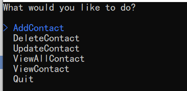
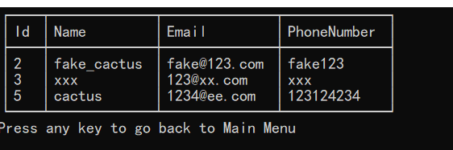
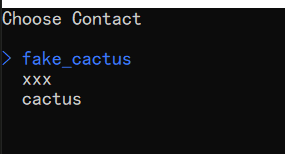
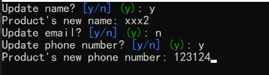
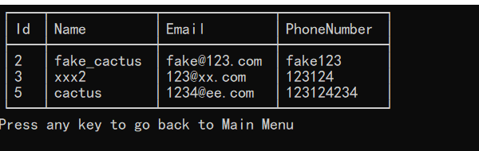

# PhoneBook Console Applicaton

This phonebook console application was developed based on C#/.Net Entity Framewokr and Spectre.Console nuget library.

## Features

* Users can Add, Delete, Update and Read from a database, using the console.

## Some screenshots

## Reference

* [Entity Framework Docs](https://learn.microsoft.com/en-us/ef/core/get-started/overview/first-app?tabs=netcore-cli)
* [CRUD Console APP with EF on Youtube](https://www.youtube.com/watch?v=tDiJdthMs1Q&list=PL4G0MUH8YWiDcv8EUWTbDxDlkSndfh-T0)
