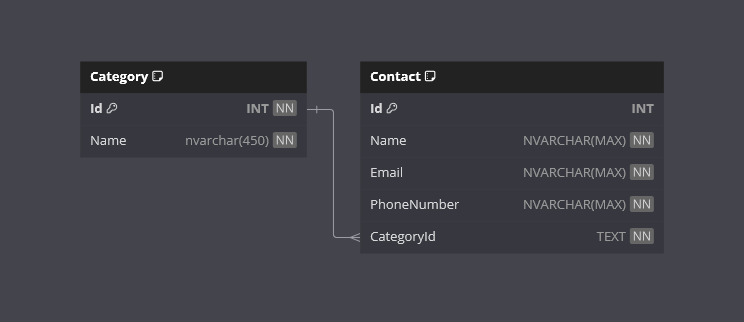

<h1>Phonebook</h1>

Welcome to the Phonebook App!

This is a .NET project designed to demonstrate using the Entity Framework ORM and SQL Server.

## Requirements

- [x] Application must be able to store contacts and their phone numbers.
- [x] Users must be able to perform CRUD operations against a database using a console application.
- [x] Database interaction must be via Entity Framework.
- [x] No raw SQL.
- [x] The application must contain a Contact class with at lease Id int, Name string, Email string and PhoneNumber string.
- [x] Email addresses must be validated and the expected formats communicated to the user.
- [x] Phone numbers must be validated and the expected formats communicated to the user.
- [x] The Code-First approach must be taken with Entity Framework.
- [x] The database provider must be SQL Server.

### Additional Requirements

- [x] Create categories of contacts (i.e. Family, Friends, Work, etc).

## Features

- **Contacts**

    View a list of contacts. Create a new contact, update or delete an existing contact.

- **Database Seeding**

    Set `SeedDatabase` to `true` in the appsettings.json file if you wish to generate mocked up seed data on initial database creation.

## Getting Started

**IMPORTANT!**

I have already created and staged the InitialCreate database migration in the repo.

Entity Framework will handle the database creation for you.

The console application will handle the performing of any created database migrations.

### Prerequisites

- .NET 8 SDK installed on your system.
- A code editor like Visual Studio or Visual Studio Code
- SQL Server
- SQL Server Management Studio (SSMS)

### Installation

1. Clone the repository:
    - `git clone https://github.com/cjc-sweatbox/phonebook.git`

2. Configure the application:
    - Navigate to the `.\src\Phonebook.ConsoleApp\` directory.
    - Update the `App.config` file with your database connection string.

3. Build the application:
    - `dotnet build`

### Running the Application

1. Run the application using the .NET CLI:
    - Navigate to the `.\src\Phonebook.ConsoleApp\` directory.
    - `dotnet run`

### Usage

- **Database Migrations**: On initial startup, any outstanding database migrations will be performed.
- **Database Seeding**: On initial startup, required database seeding will be performed, and optional database seeding may be performed the `SeedDatabase` App.config setting is set to `true`.
- **Main Menu**: Select an option to perform.
- **View Contacts**: Displays all your contacts.
- **Create Contact**: Add a contact name, email, phone number and assign a category.
- **Update Contact**: Opens a selection page for a contact to update in the database.
- **Remove Contact**: Opens a selection page for a contact to delete from the database.
- **Close Application**: Closes the application.

## How It Works

- **Console Application**: Display is mostly through the [Spectre Console](https://spectreconsole.net/) library.
- **Menu Navigation**: Navigate the application through the Selection Prompts class provided by Spectre to perform actions.
- **Email Validation**: Emails are validated using System.ComponentModel.DataAnnotations library.
- **Phone Number Validation**: Phone numbers are validated using the [libphonenumber-csharp](https://github.com/twcclegg/libphonenumber-csharp) library.
- **Data Storage**: An SQL Server database is required to be created before running the application.
- **Data Access**: Code-First Entity Framework is used for the database access methods.
- **Data Seeding**: The required Categories data is seeded on first time start-up. If configured, a set of mock Contacts will be added.
- **Report Display**: Uses the Tables class provided by Spectre to display structured and formatted tables.

## Database

## Contributing

Contributions are welcome! Please fork the repository and create a pull request with your changes. For major changes, please open an issue first to discuss what you would like to change.

## License

This project is licensed under the MIT License. See the [LICENSE](./LICENSE) file for details.

## Contact

For any questions or feedback, please open an issue.

---
***Happy Phonebooking!***
